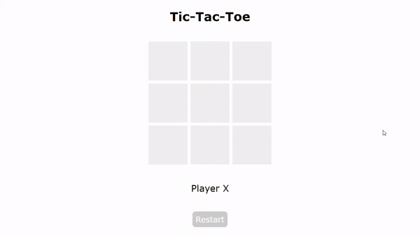

# Jogo da Velha (Tic-tac-toe) (projeto DIO)

Projeto desenvolvido durante o Bootcamp JavaScript Game Developer da DIO (Digital Innovation One).

O projeto consiste em um simples jogo da velha, também conhecido como tic-tac-toe. O jogo foi feito apenas com HTML, CSS e JavaScript. 

## Demonstração :video_game:

O jogo alterna entre os jogadores "X" e "O", checa se houve algum vencedor e destaca as casas da jogada vencedora, exibindo o vencedor no final




## Para executar o projeto :computer:

Basta clonar este repositório 

```
git clone https://github.com/davi-santos5/dio-game-tic-tac-toe.git
```

E executar o arquivo `index.html` no seu navegador de preferência.

